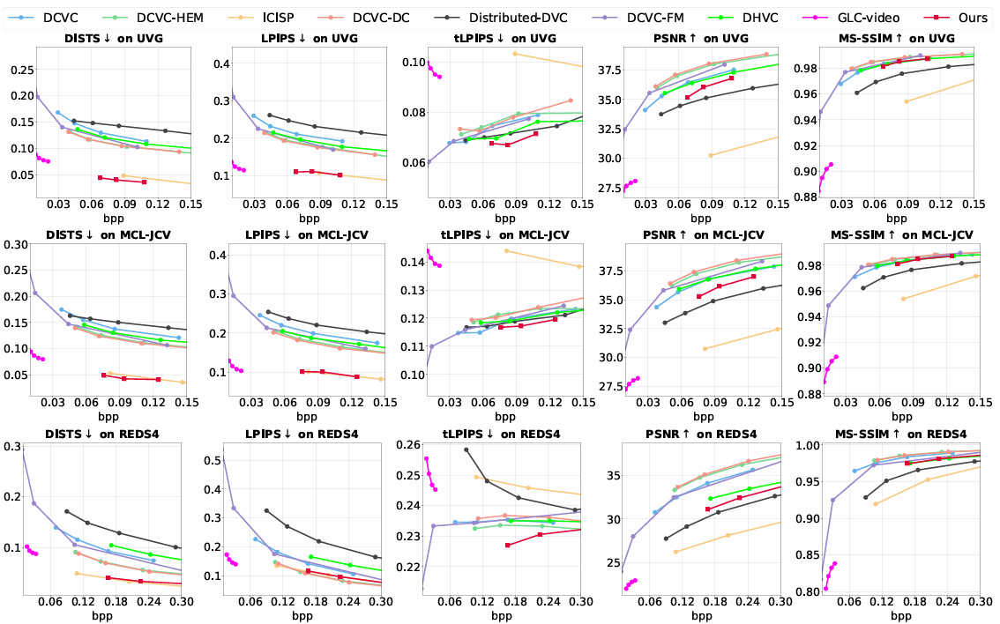
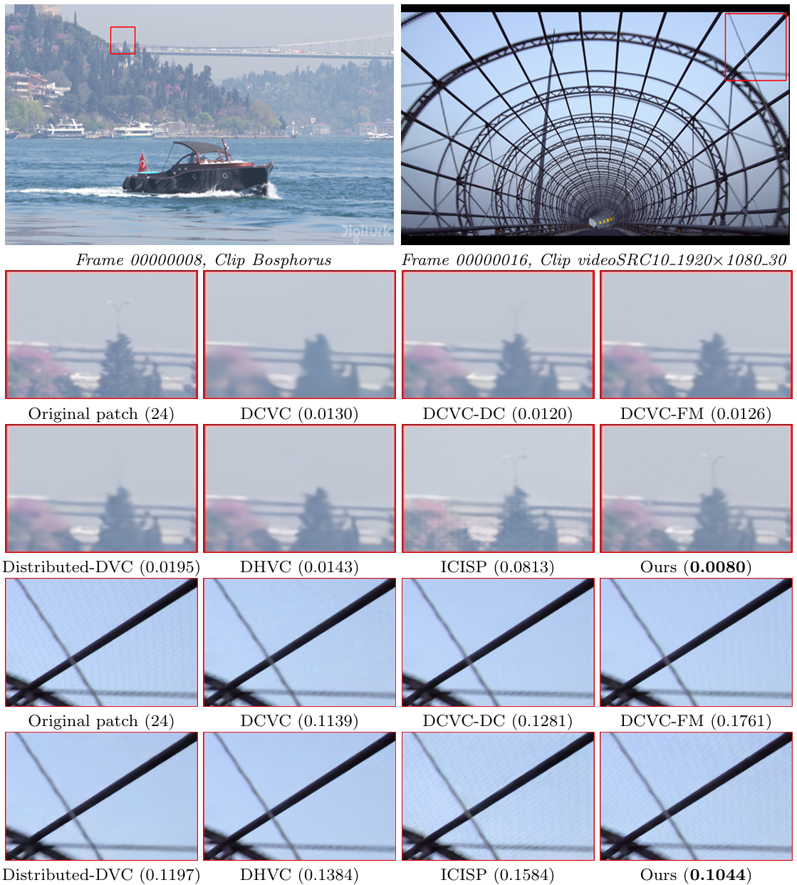

# STM-PVC

[Hao Wei](https://scholar.google.com.hk/citations?user=hhNFVW0AAAAJ&hl=zh-CN), Yanhui Zhou, Chenyang Ge.

#### 🔥🔥🔥 News

- **2026-01-30:** This repo is released.

## 🔗 Contents

- [ ] [Datasets](#Datasets)
- [ ] [Installation](#Installation) 
- [ ] [Models](#Models)
- [ ] [Train and Test](#TrainAndTest)
- [x] [Results](#Results)
- [ ] [Citation](#Citation)
- [ ] [Acknowledgements](#Acknowledgements)

## 📊 Datasets

##  🔎 Results

&ensp;Quantitative Comparisons (click to expand) 

&ensp;Visual Comparisons (click to expand) 

## 💡 Acknowledgements
